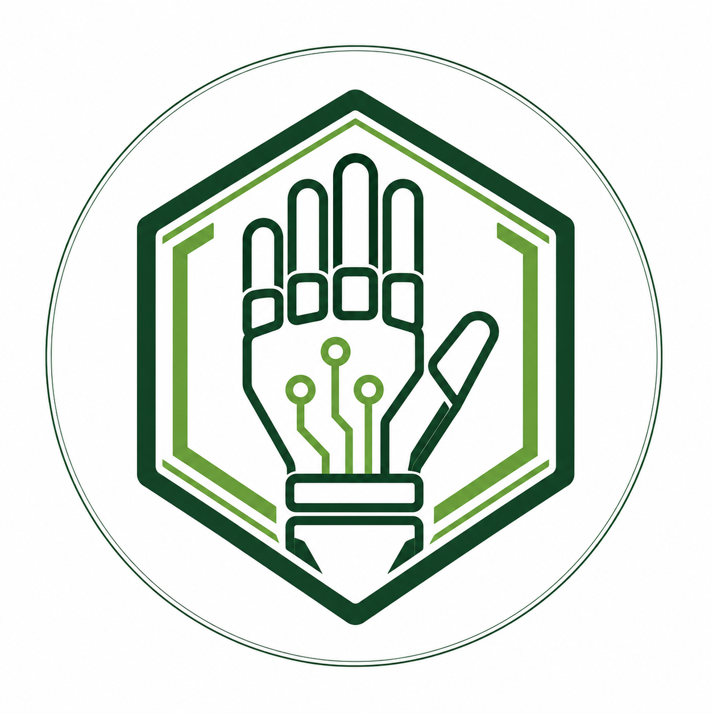

# 🤖 Pytyvõ Motion — Rehabilitación Robótica de la Mano

> **Proyecto desarrollado para el concurso Samsung Solve For Tomorrow**  
> *Ciudad del Este, Paraguay — 2026*

## 📌 Resumen del Proyecto

**Pytyvõ Motion** es un sistema robótico de rehabilitación modular, accesible y con base biomecánica, diseñado para personas que han sufrido Accidente Cerebrovascular (ACV), traumatismos motrices o afecciones neuromusculares en Paraguay.

El dispositivo combina un exoesqueleto textil con cables tensores de baja fricción, servomotores con control PWM fino y una guía sonora en **español y guaraní**, logrando reducir los costos en más de un **60%** respecto a alternativas comerciales importadas.

---

## 🔬 Enfoque STEAM Integrado

El proyecto articula las 5 disciplinas de la metodología STEAM:

* **S (Ciencia / Biomecánica)**: Estudio de los rangos articulares de flexo-extensión y estimulación neuroplástica mediante terapia de repetición continua.
* **T (Tecnología / Firmware)**: Microcontrolador con modulación por ancho de pulsos (PWM), interfaz digital y alertas bilingües.
* **E (Ingeniería / Biomimética)**: Exoesqueleto impreso en 3D con distribución de carga ergonómica sobre el antebrazo.
* **A (Arte & Diseño Humano)**: Diseño biofílico y amigable para el paciente, ensamble textil artesanal de alta durabilidad y estímulos sensoriales táctiles.
* **M (Matemáticas / Cálculo)**: Mapeo angular trigonométrico de 0° a 90°, momentos de torsión (kg·cm) y ciclos de flexión.

---

## 🛠️ Tecnologías y Herramientas

* **Frontend Web**: HTML5 semántico, CSS3 Apple Neo-Brutalism, JavaScript ES6+ modular.
* **Renderizado 3D**: Three.js / WebGL con visor orbital y presets mecánicos interactivos.
* **Hardware**: Microcontrolador Arduino / Servos de alto torque / Ensamble textil reforzado.
* **Modelado 3D**: Archivos GLB/GLTF para fabricación aditiva (impresión 3D).

---

## 👥 Equipo de Desarrollo

Estudiantes y mentores participantes del programa **Samsung Solve For Tomorrow**.

* **Instagram Oficial**: [@pytyvomotion.py](https://www.instagram.com/pytyvomotion.py/)
